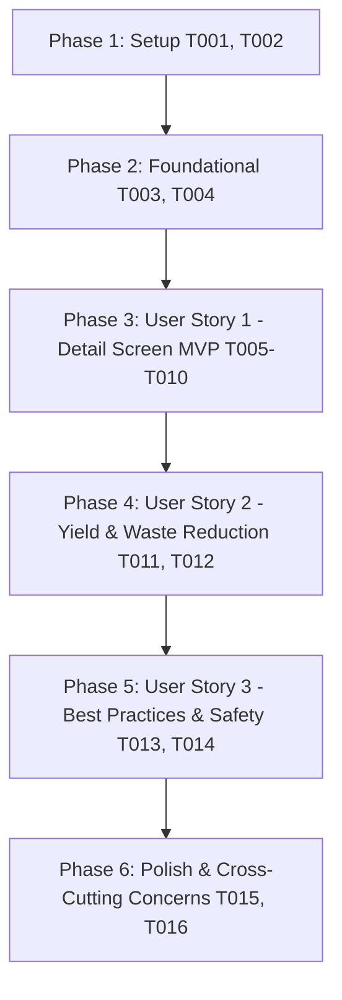

# Tasks: Catálogo de Derivados e Aproveitamento Integral do Caju

**Input**: Design documents from `specs/002-catalogo-derivados/` (`spec.md`, `plan.md`, `research.md`, `data-model.md`, `contracts/`, `quickstart.md`)  
**Prerequisites**: `plan.md` (required), `spec.md` (required for user stories), `research.md`, `data-model.md`, `contracts/`

**Tests**: Testes manuais e de compilação estrita via `npm run typecheck` e verificação em ambiente Web (`npm run web`) e Android (`npm run android`) conforme orientado no `quickstart.md`.

**Organization**: Tarefas organizadas por história de usuário para assegurar implementação e validação independentes.

## Format: `[ID] [P?] [Story] Description`

- **[P]**: Pode rodar em paralelo (arquivos distintos, sem dependências pendentes)
- **[Story]**: User story correspondente (`[US1]`, `[US2]`, `[US3]`)
- Caminhos absolutos/relativos exatos incluídos nas descrições

---

## Phase 1: Setup (Shared Infrastructure)

**Purpose**: Criação das definições de tipos e extensões de roteamento compartilhadas.

- [ ] T001 [P] Create TypeScript models and interfaces for Derivados (DerivadoDetail, PassoProcessamento, RendimentoInfo, DerivadoCategoria) in types/derivados.ts
- [ ] T002 [P] Update navigation route parameter definitions to support dynamic route [id] in types/navigation.ts

---

## Phase 2: Foundational (Blocking Prerequisites)

**Purpose**: Serviço de dados curados locais e integração do catálogo que BLOQUEIA a implementação das telas.

**⚠️ CRITICAL**: Nenhuma user story deve ser iniciada antes da conclusão desta fase.

- [ ] T003 Implement centralized local data provider service with getDerivadoById and getAllDerivados for the 4 core derivatives in services/derivadosService.ts
- [ ] T004 Connect derivative catalog cards to dynamic route navigation via router.push in app/(tabs)/derivados/index.tsx

**Checkpoint**: Base foundational pronta — a implementação das histórias de usuário pode começar.

---

## Phase 3: User Story 1 - Consulta Detalhada do Derivado com Guia de Processamento (Priority: P1) 🎯 MVP

**Goal**: Implementar a tela dinâmica `app/(tabs)/derivados/[id].tsx` para navegação, visualização de insumos, equipamentos, etapas sequenciais de preparo e tratamento de rota inexistente (`EmptyState`).

**Independent Test**: Tocar no card "Cajuína Tradicional Piauiense" na listagem de derivados e verificar se a rota `/derivados/cajuina` é carregada exibindo histórico, equipamentos, insumos e os 5 passos ordenados de produção, com botão de retorno funcional de 48x48dp.

### Implementation for User Story 1

- [ ] T005 [US1] Create dynamic route screen scaffold with useLocalSearchParams, ScrollView, and responsive container (maxWidth: 800) in app/(tabs)/derivados/[id].tsx
- [ ] T006 [P] [US1] Implement header with back button (AccessiblePressable >= 48x48dp) and derivative category badge in app/(tabs)/derivados/[id].tsx
- [ ] T007 [P] [US1] Implement overview & summary card section displaying icon, title, description, estimated time, and difficulty in app/(tabs)/derivados/[id].tsx
- [ ] T008 [P] [US1] Implement raw material & required equipment badge list card in app/(tabs)/derivados/[id].tsx
- [ ] T009 [US1] Implement sequential processing step-by-step list with order badges, detailed instructions, and field tips in app/(tabs)/derivados/[id].tsx
- [ ] T010 [US1] Implement invalid route parameter fallback rendering EmptyState with action button returning to catalog in app/(tabs)/derivados/[id].tsx

**Checkpoint**: Neste ponto, a User Story 1 (MVP) estará plenamente funcional e navegável na Web e no Android.

---

## Phase 4: User Story 2 - Métricas de Rendimento e Aproveitamento Integral do Fruto (Priority: P2)

**Goal**: Exibir dados educativos e agroindustriais de conversão de matéria-prima, valor agregado e combate ao desperdício do pedúnculo.

**Independent Test**: Acessar o detalhe de um derivado (ex.: Cajuína ou Fibra) e validar a exibição do card de destaque de "Aproveitamento Integral & Rendimento" com a taxa de conversão e subprodutos secundários aproveitáveis.

### Implementation for User Story 2

- [ ] T011 [P] [US2] Implement Yield & Waste Reduction metrics card displaying raw material ratio, final product yield, and secondary byproducts in app/(tabs)/derivados/[id].tsx
- [ ] T012 [US2] Enhance yield metrics and peduncle conservation descriptions across all 4 derivatives in services/derivadosService.ts

**Checkpoint**: As User Stories 1 e 2 estarão integradas, entregando a proposta central de valor contra o desperdício do caju.

---

## Phase 5: User Story 3 - Roteiro de Boas Práticas e Higiene Rural (Priority: P3)

**Goal**: Apresentar normas sanitárias, conservação e alertas de segurança operacional (especialmente contra o LCC cáustico e choque térmico).

**Independent Test**: Rolar até a parte inferior da tela de detalhes de cada derivado e confirmar a renderização das seções de "Boas Práticas" e "Segurança no Manuseio".

### Implementation for User Story 3

- [ ] T013 [P] [US3] Implement Best Practices and Food Hygiene section with rural quality standards in app/(tabs)/derivados/[id].tsx
- [ ] T014 [P] [US3] Implement Operational Safety Alert card for hazardous steps (caustic LCC handling, steam boiling protection) in app/(tabs)/derivados/[id].tsx

**Checkpoint**: Todas as 3 User Stories estarão completas, fornecendo uma experiência educativa rural completa.

---

## Phase 6: Polish & Cross-Cutting Concerns

**Purpose**: Verificação de qualidade estrita, acessibilidade e responsividade universal.

- [ ] T015 [P] Run strict TypeScript typecheck (npm run typecheck) and ensure zero compilation errors across all new and updated files
- [ ] T016 [P] Audit rural accessibility standards (hitboxes >= 48x48dp, contrast, responsive layout on mobile and desktop web) across the derivatives module

---

## Dependencies & Completion Order

---

## Parallel Execution Examples

- **Na Fase 1**: `T001` (`types/derivados.ts`) e `T002` (`types/navigation.ts`) podem ser executados em paralelo.
- **Na Fase 3 (US1)**: `T006` (Header com botão de voltar), `T007` (Card de resumo) e `T008` (Card de equipamentos) podem ser desenvolvidos em paralelo após a estrutura base de `T005`.
- **Na Fase 5 (US3)**: `T013` (Boas práticas) e `T014` (Alertas de segurança) podem ser desenvolvidos em paralelo.
- **Na Fase 6**: `T015` (typecheck) e `T016` (auditoria de acessibilidade) podem ser validados simultaneamente.

---

## Implementation Strategy

1. **MVP Incremental (User Story 1)**: Entregar primeiro a navegação e a tela dinâmica básica com as etapas de preparo funcionais (`T001` até `T010`).
2. **Valor Agronômico (User Story 2)**: Adicionar as métricas de aproveitamento integral e rendimento (`T011` e `T012`).
3. **Segurança e Higiene (User Story 3)**: Adicionar os avisos práticos de boas práticas e manuseio seguro (`T013` e `T014`).
4. **Validação Final**: Execução do `quickstart.md` no navegador e emulador com checagem de tipos estrita (`T015` e `T016`).
