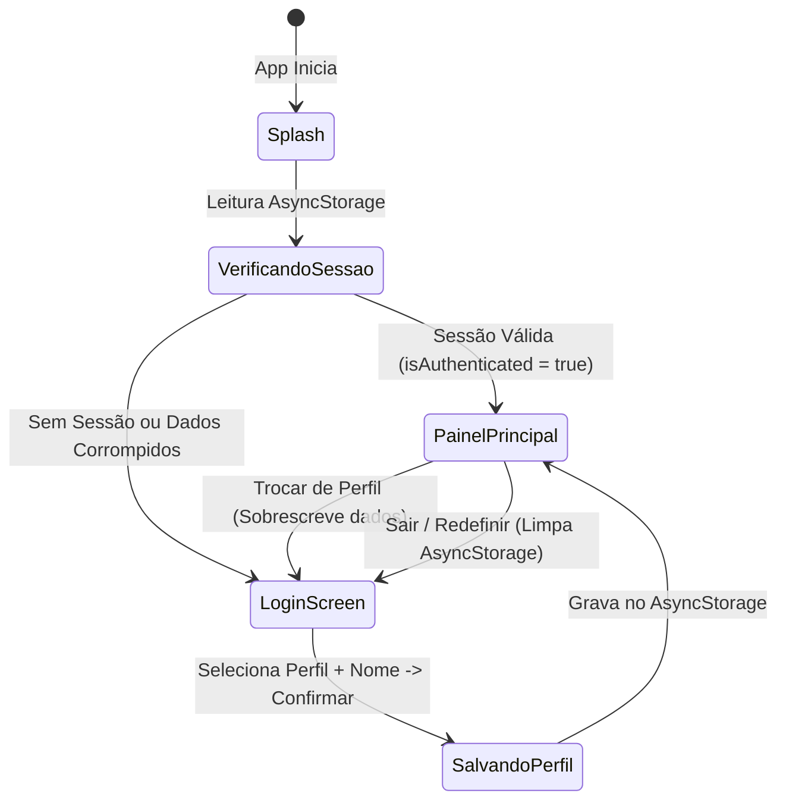

# Data Model & Storage Schema: Identificação e Login Local (TEL-LOG-01)

**Feature**: `002-local-login`  
**Date**: 2026-09-24  
**Status**: Ready  

---

## 1. Entities

### 1.1 `UserProfile`
Representa a identidade ativa do operador no aplicativo CajuTech.

| Campo | Tipo | Obrigatório | Padrão | Descrição |
| :--- | :--- | :---: | :--- | :--- |
| `id` | `string` | Sim | UUID / timestamp | Identificador único local gerado no momento do registro. |
| `role` | `'farmer' \| 'student' \| 'visitor'` | Sim | `'farmer'` | Papel de atuação selecionado pelo usuário. |
| `displayName` | `string` | Sim | Nome padrão do papel | Nome ou apelido de até 40 caracteres exibido nas saudações. |
| `preferredCity` | `string` | Sim | `'Piripiri - PI'` | Município de referência para clima e cotações de mercado. |
| `createdAt` | `string` | Sim | ISO 8601 | Data e hora de criação do perfil no dispositivo. |
| `updatedAt` | `string` | Sim | ISO 8601 | Data e hora da última modificação ou troca de perfil. |

### 1.2 `AuthSession`
Representa o estado da sessão no aparelho para controle de fluxo de navegação e inicialização.

| Campo | Tipo | Obrigatório | Descrição |
| :--- | :--- | :---: | :--- |
| `isAuthenticated` | `boolean` | Sim | `true` se existe um perfil ativo registrado e válido. |
| `activeProfile` | `UserProfile \| null` | Sim | Dados do perfil do usuário ativo ou `null` se desconectado. |
| `lastActiveAt` | `string` | Sim | Carimbo de data/hora (ISO 8601) da última interação ou abertura. |

---

## 2. AsyncStorage Keys & Serialization

As informações são persistidas no armazenamento do dispositivo utilizando chaves com prefixo padronizado:

```text
@cajutech:user_profile  -> JSON string de UserProfile
@cajutech:auth_session  -> JSON string de AuthSession
```

### Exemplo de Payload Gravado (`@cajutech:user_profile`):
```json
{
  "id": "usr_local_1727211600000",
  "role": "farmer",
  "displayName": "Seu Raimundo",
  "preferredCity": "Piripiri - PI",
  "createdAt": "2026-09-24T18:30:00.000Z",
  "updatedAt": "2026-09-24T18:30:00.000Z"
}
```

---

## 3. Validation & Sanitization Rules

1. **Validação do Papel (`role`)**:
   - Deve ser obrigatoriamente um dos 3 valores permitidos: `'farmer'`, `'student'`, `'visitor'`.
   - Se um valor inválido for lido do storage (dados corrompidos), o sistema reverte para o estado não autenticado e exibe a tela de login.
2. **Sanitização do Nome de Exibição (`displayName`)**:
   - `displayName = displayName.trim().slice(0, 40)`.
   - Se o campo estiver vazio ou consistir apenas de espaços, aplica-se o fallback automático:
     - `'farmer'` → `"Produtor Rural"`
     - `'student'` → `"Estudante"`
     - `'visitor'` → `"Visitante"`
3. **Município Padrão (`preferredCity`)**:
   - Sempre inicializado como `"Piripiri - PI"` no primeiro acesso (TEL-LOG-01 / Clarificação 2).
4. **Perfil Único Ativo**:
   - Ao trocar de perfil (`switchRole` ou novo login), o registro anterior é integralmente sobrescrito (Clarificação 1). Não há retenção de histórico de perfis anteriores.
5. **Ação de Sair / Redefinir**:
   - Ao acionar "Sair / Redefinir", ambas as chaves (`@cajutech:user_profile` e `@cajutech:auth_session`) são removidas via `AsyncStorage.multiRemove` (Clarificação 3).

---

## 4. State Transitions & Lifecycle


